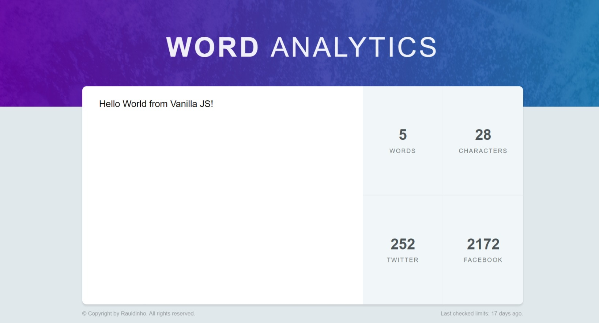

# Word Analytics Project

This is a simple JavaScript project that counts the number of words, characters, Twitter and Facebook allowed limits in a given text. It's a lightweight and easy-to-use tool that can be integrated into any web page or used as a standalone application.

## Features

- **Real-time word counting**: As you type, the word counter updates instantly.
- **User-friendly interface**: Simple and clean design.
- **Lightweight**: Minimal dependencies, pure JavaScript.

## Screenshot

